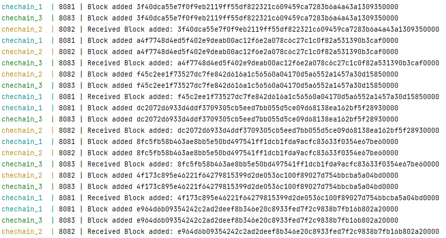

master
[](https://github.com/RainixSTR/CheChain/actions/workflows/gradle.yml)  
development
[](https://github.com/RainixSTR/CheChain/actions/workflows/gradle.yml)
# CheChain
***


Implementation of blockchain with 3 node cluster. Written on Java with usage of HTTP for communication.

## How to run
***
1. Build docker image
```
docker build -t blockchain:latest .
```
2. Run with docker-compose
```
docker-compose up
```

## Example
***


